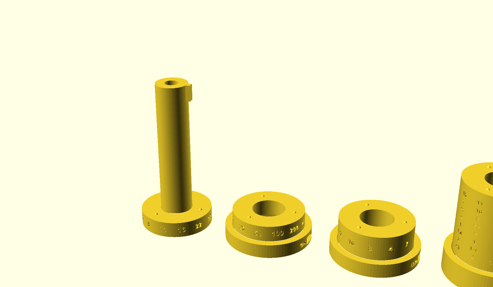
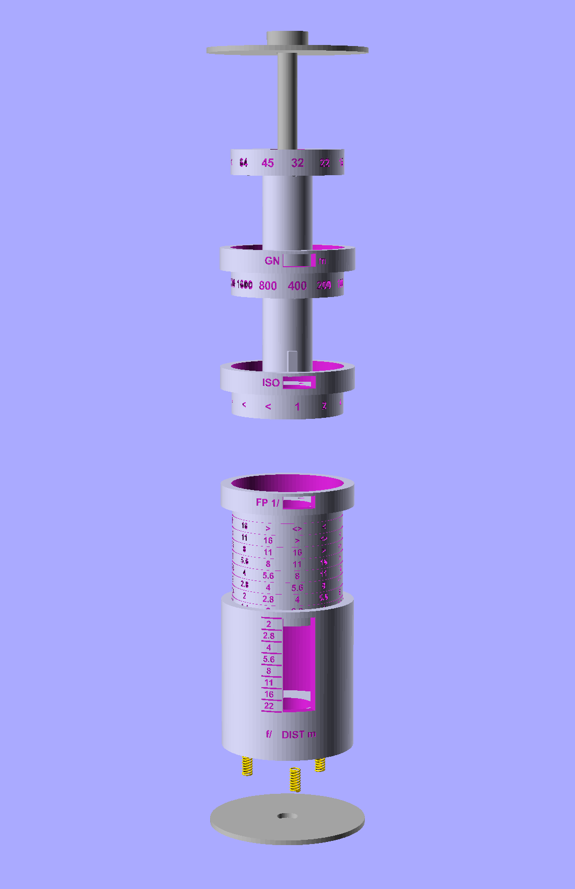

# Analog flash calculator

A few years ago, while experimenting with flashes in analog photography, [I made
a quick mockup of a flash power calculator, using graph paper wrapped around a 
dowel.](https://www.brianssparetime.com/posts/im-learning-to-use-a-flash-on-my-analog-camera-so-i-made-an-analog-fla/)

Someone on reddit suggewsted a 3d printed one, but at the time it was 
beyond abilities (or more of a time investment than I wanted to make).  Now
I've done a few other 3d printing projects, built [SCADwright](https://github.com/brianssparetime/SCADwright),
and I thought I'd return to this idea.

Though this is largely just a 3d version of my paper model, I did make a handful 
of changes.  The paper version had three layers and baked the guide number in 
as a constant; adding a fourth ring turns the guide number into a setting, 
so this tool is useful to people whose flash has a different GN than mine.  The
numbers in the window also run circumferentially rather than down the axis,
which enables a much more compact outer shape for the whole thing.

In essence, this calculator wraps the classic exposure dial's logarithmic disc slide rule 
around an axis  Four printed rings turn against each other on a single bolt. 
Three of them have setting windows (guide number GN, ISO, and flash power FP), and the fourth
contains a readout window giving your the relationship between aperture and distance.

<p align="center">
  
</p>

*The whole instrument is 73 x 43 mm.*


## Using it

Set the three rings in order. Each has a window showing the value it
currently holds.

1. **GN** — the flash's guide number, in metres at ISO 100 and 50 mm
   coverage. Read it off the flash's own table for the zoom setting you
   are using; do not derive it from the focal length.
2. **ISO** — the film speed.
3. **POWER 1/** — the power the flash is set to, as the denominator: 1
   for full power, 4 for quarter.

The long slot then shows the distance the flash reaches under each
aperture heading, in metres. Where an aperture falls off the end of the
scale at that setting, its column is blank.

To change a setting, twist the two segments either side of its seam
against each other. The spring lets the bumps cam out of their dimples,
so nothing has to be pulled apart first.

Turned past the end of a scale, a window shows an arrow instead of a
blank. It points toward the nearer end of that scale, so turning that way
brings the marks back.

## How it works

Every scale is logarithmic, and one detent of rotation moves one stop on any
of them. 

| quantity | range | one stop |
|---|---|---|
| guide number | 5.6 to 64 (metres, ISO 100, 50 mm) | x sqrt(2) |
| ISO | 25 to 3200 | x 2 |
| distance | 1 to 16 m (3.3 to 52 ft) | x sqrt(2) |
| aperture | f/2 to f/22 | x sqrt(2) |
| power | 1/1 to 1/128 | / 2 |

Guide number is defined as GN = aperture x distance at ISO 100 and full
power. Raising ISO a stop or cutting power a stop each move the effective
guide number by one stop, so the whole instrument reduces to one relation
in stops:

    aperture + distance + power - ISO = GN

Each pair of neighbouring segments contributes one term through its
window, and the four rotations sum to that identity.

For guide numbers between those shown, just use the next lowest one for a little
extra exposure.  

Feet are just a rounded approximations of the meter version.

## Building the models

All five printed parts come from `main.py`.

```
python3 -m venv .venv
.venv/bin/pip install -e ../SCADwright
.venv/bin/pip install "scadwright[curved-text]"     # proportional glyph spacing

.venv/bin/scadwright build main.py                   # print plate, into out/
.venv/bin/scadwright build main.py --variant display
.venv/bin/scadwright build main.py --variant exploded
.venv/bin/scadwright build main.py --variant section
```

The main readout reads distance by default. Building with `--readout power` swaps
distance and power over, so the slot shows the power each aperture needs
at a distance you have set, which is what the paper original did.
Aperture stays put either way.

The main readout holds one row per column, so its distances come in metres unless
you ask for `--units feet`. Both mark the same detents, so nothing moves
but the engraving. Guide numbers stay in metres, as flashes quote them.

## Printing

The print variant stands every segment on its axis. Bores come out round
without support that way, engraving on a vertical wall stays crisp, and
the windows need nothing more than a short bridge across the top.

Print them bumps-up, as modelled. A dimple opening downward is a 57
degree overhang and prints clean, while a dome pointing downward sags.

<p align="center">
  
</p>

*The whole tool is one plate. Left to right: the inner tube, the GN ring,
the ISO ring, the third ring carrying the readout table, and the end cap.
Each stands on the axis it was engraved around.*

- The inner tube is a 16 mm column standing 75 mm tall. Use a brim.
- Thinnest wall is 3.4 mm, leaving 2.95 mm under an engraving beside a
  window.
- Running fits carry 0.2 mm of radial clearance. If your printer runs
  tight, raise `slip` in `dims.py` rather than sanding the segments.
- Engravings are 0.45 mm deep. A wipe of paint into them, or a filament
  change on the top surface, makes the scales far easier to read.

## Assembly

Besides the printed parts you need one 1/4-20 bolt, at least 3 1/2 inches 
(preferably fully threaded), and one nut and two 1/4 inch fender washers of
1 3/4 or 2 inch outside diameter. Both washers have to be wider than the
43 mm (1 11/16 inch) body diameter, so they cap the ends rather than drop
into them.

The click comes from three compression springs, 3.5 mm across the coil
with 0.5 mm wire and 10 mm long
(e.g., [these](https://www.ebay.com/itm/287411987228)). They stand 3 mm out of
their pockets, which is the range the nut has to tighten through, so the
click can be set anywhere from light to firm. For a firmer one still,
raise `spring_count` in `dims.py`.

<p align="center">
  
</p>

*Drawn apart along the axis, in the order they go on. The inner tube runs
the whole length; the cap keys onto its far end once the three rings are
aboard.*

<p align="center">
  
</p>

*The same five pieces closing up.*

Everything threads on from the nut end, in order, with every ring set to
GN 32, ISO 400, FP 1/1. Each ring's bore is channelled for the inner
tube's key on its window meridian, and only at that setting do the
channels line up. Anywhere else a ring stops against the key.

1. Slide `gn_ring`, then `iso_ring`, then `dist_ring` onto the inner
   tube. Each goes over its plain outside and seats against the flange of
   the one before it.
2. Slide `end_cap` on over the key at the tube's far end. It is a sliding
   fit with nothing to bottom against, so the tube never takes bolt load.
3. Drop a spring into each pocket in the cap's end face. They stand 3 mm
   proud of it.
4. Bolt and washer through from the head end, bearing on the inner tube's
   end face.
5. Washer and nut on the spring end. The washer meets the springs before
   it meets the cap's end face, which bounds the travel. Tighten until
   the segments click firmly but still turn by hand.

The force path runs nut, washer, springs, cap, dist ring, iso ring, gn
ring, inner tube, washer, bolt head. One path, with the springs in
series, so a bump can climb out of its dimple without the assembly having
to stretch.

| part | what it carries |
|---|---|
| `inner_tube` | GN scale, and the key the end cap seats on |
| `gn_ring` | GN window, ISO scale |
| `iso_ring` | ISO window, and the third setting's scale |
| `dist_ring` | third setting's window, and the readout table |
| `end_cap` | readout slot, aperture headings, spring pockets, nut |

## Built with SCADwright

[SCADwright](https://github.com/brianssparetime/SCADwright) is the
OpenSCAD emitter I wrote. You design in Python and it generates the
OpenSCAD source that renders to STL. Parts are Python classes that
declare their dimensions as equations and can read each other, so a
shared measurement exists in one place and a set of arguments that cannot
be built fails with an error rather than a bad render.

This calculator is a small application of it, and it went a good deal
faster for the framework being there. The
[`Spec`](https://github.com/brianssparetime/SCADwright/blob/master/docs/specs_and_adjustments.md)
in `dims.py` holds the bands every segment is cut against, so a clearance
change resolves through the whole stack instead of being chased by hand.
[`add_text()`](https://github.com/brianssparetime/SCADwright/blob/master/docs/add_text.md)
wraps the scales around cylindrical walls with proportional spacing,
which is most of the instrument.
[`@variant`](https://github.com/brianssparetime/SCADwright/blob/master/docs/variants.md)
and [`morph`](https://github.com/brianssparetime/SCADwright/blob/master/docs/morph.md)
give the print plate, the posed views, the section, and the assembly
animation from one design.

## Layout

```
scales.py   scale tables, stop arithmetic, photometric verification
dims.py     every shared measurement, as a Spec with its own rules
parts.py    the five printed parts
main.py     Design, variants, and the assembly morph
check.py    correctness and buildability checks
renders.py  beauty shots, and the camera settings that produce them
out/        generated .scad and .stl; not tracked
rendered_img/  published images; tracked
```
