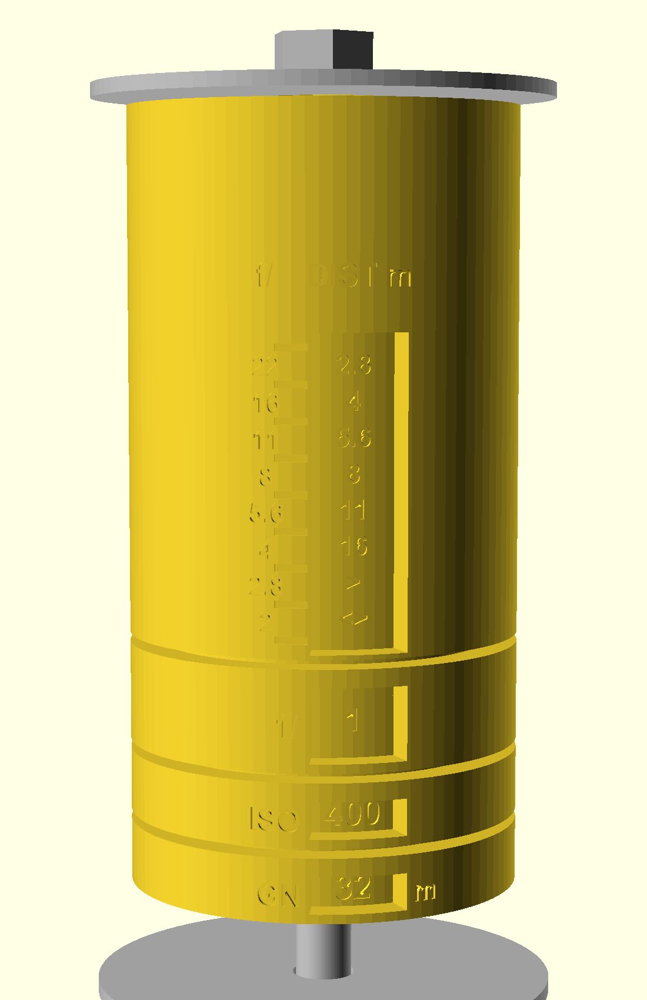

# Analog flash calculator

This calculator wraps an exposure dial's logarithmic slide rule around an
axis instead of laying it out flat on a disc. Four printed rings turn
against each other on a single bolt. Three of them carry a setting apiece
behind its own window, and the long slot in the fourth gives the answer.

Dial in the flash's guide number, the film speed, and the power the flash
is set to, and the slot shows how far that flash reaches at every
aperture from f/2 to f/22 at once. It is held upright and read down the
near face, so every label runs around the barrel rather than along it.

<p align="center">
  
</p>

*The whole instrument is 87 x 43 mm. It stands on end and reads down one
face: guide number, film speed and power in their windows, then the slot
giving the distance reached at each aperture. Every seam is a setting.*

I made [a paper one](https://www.brianssparetime.com/posts/im-learning-to-use-a-flash-on-my-analog-camera-so-i-made-an-analog-fla/)
a few years ago, wrapped around a dowel, and the suggestion I got then
was to print one. This is that. The paper version had three layers and
baked the guide number in as a constant; adding a fourth ring turns the
guide number into a setting, so one tool covers every flash.

## Using it

Set the three rings in order. Each has a window showing the value it
currently holds.

1. **GN** — the flash's guide number, in metres at ISO 100 and 50 mm
   coverage. Read it off the flash's own table for the zoom setting you
   are using; do not derive it from the focal length.
2. **ISO** — the film speed.
3. **POWER 1/** — the power the flash is set to, as the denominator: 1
   for full power, 4 for quarter.

The long slot then shows the distance the flash reaches under each
aperture heading, in metres. Where an aperture falls off the end of the
scale at that setting, its column is blank.

Say you are shooting a Mecablitz 45 on ISO 400 at full power. Set GN 45,
ISO 400, POWER 1, and the slot gives you 4 m at f/22 through 16 m at
f/5.6. Anything wider is blank, because the flash reaches past the end of
the scale.

To change a setting, twist the two segments either side of its seam
against each other. The spring lets the bumps cam out of their dimples,
so nothing has to be pulled apart first.

The windows only sit in a row for one setting, since each rides on the
segment carrying it and those have to turn relative to each other to hold
a setting. The scales are engraved so that the row falls at GN 32, ISO
400, full power, where every window and the slot line up along one side
of the barrel. Away from there, roll the tool in your hand to bring each
window into view. In practice that matters little: the guide number gets
set once per flash, the film speed once per roll, and only the third ring
moves between shots.

A window with nothing to show carries an arrow rather than a blank, since
every scale is shorter than the twelve detents around the tool. It points
toward the nearer end of its scale, so turning that way brings the marks
back into view.

## How it works

Every scale is logarithmic, and one detent of rotation is one stop on all
of them. That is what lets a single 30-degree pitch serve five different
quantities.

| quantity | range | one stop |
|---|---|---|
| guide number | 5.6 to 64 (metres, ISO 100, 50 mm) | x sqrt(2) |
| ISO | 25 to 3200 | x 2 |
| distance | 1 to 16 m (3.3 to 52 ft) | x sqrt(2) |
| aperture | f/2 to f/22 | x sqrt(2) |
| power | 1/1 to 1/128 | / 2 |

Guide number is defined as GN = aperture x distance at ISO 100 and full
power. Raising ISO a stop or cutting power a stop each move the effective
guide number by one stop, so the whole instrument reduces to one relation
in stops:

    aperture + distance + power - ISO = GN

Each pair of neighbouring segments contributes one term through its
window, and the four rotations sum to that identity.

Guide numbers land on the same rounded sqrt(2) series as the apertures,
so a GN 38 flash sits between the 32 and 45 marks. That is the price of a
single detent pitch shared by every scale, and it falls inside the margin
by which published guide numbers are optimistic anyway. Round down if you
want the exposure.

Feet cannot land on round numbers when metres do, so the foot row is an
honest rounding of the same detents rather than a prettied-up second
series.

## Building the models

All five printed parts come from `main.py`.

```
python3 -m venv .venv
.venv/bin/pip install -e ../SCADwright
.venv/bin/pip install "scadwright[curved-text]"     # proportional glyph spacing

.venv/bin/scadwright build main.py                   # print plate, into out/
.venv/bin/scadwright build main.py --variant display
.venv/bin/scadwright build main.py --variant exploded
.venv/bin/scadwright build main.py --variant section
```

The slot reads distance by default. Building with `--readout power` swaps
distance and power over, so the slot shows the power each aperture needs
at a distance you have set, which is what the paper original did.
Aperture stays put either way.

The slot has room for one row per column, so its distances are labelled
in metres unless you ask for `--units feet`. Both sets mark the same
detents, so this changes nothing but the engraving. Where distance is a
setting rather than the answer it sits in a window with room for two
rows, which carry metres and feet together whatever you pass. Guide
numbers stay in metres, as flashes quote them.

## Printing

The print variant stands every segment on its axis. Bores come out round
without support that way, engraving on a vertical wall stays crisp, and
the windows need nothing more than a short bridge across the top.

Print them bumps-up, as modelled. A dimple opening downward is a 57
degree overhang and prints clean, while a dome pointing downward sags.

- The inner tube is a 16 mm column standing 75 mm tall. Use a brim.
- Thinnest wall is 3.4 mm, leaving 2.95 mm under an engraving beside a
  window.
- Running fits carry 0.2 mm of radial clearance. If your printer runs
  tight, raise `slip` in `dims.py` rather than sanding the segments.
- Engravings are 0.45 mm deep. A wipe of paint into them, or a filament
  change on the top surface, makes the scales far easier to read.

## Assembly

Besides the printed parts you need one 1/4-20 bolt, 4 inches and **fully
threaded**, since a part-threaded one has too long a plain shank for the
nut to reach. Add one nut, two 1/4 inch fender washers of 2 inch outside
diameter, and one compression spring about 16 mm across that seats in a
20 mm bore, stands a millimetre proud of it, and compresses past that
without going solid. Both washers have to be wider than the 43 mm body,
so they cap the ends rather than drop into them.

Everything threads on from the nut end, in order.

1. Slide `gn_ring`, then `iso_ring`, then `dist_ring` onto the inner
   tube. Each goes over its plain outside and seats against the flange of
   the one before it.
2. Slide `end_cap` on over the key at the tube's far end. It is a sliding
   fit with nothing to bottom against, so the tube never takes bolt load.
3. Drop the spring into the recess in the cap's end face. It stands a
   millimetre proud of the rim.
4. Bolt and washer through from the head end, bearing on the inner tube's
   end face.
5. Washer and nut on the spring end. The washer meets the spring before
   it meets the cap's rim, which bounds the travel. Tighten until the
   segments click firmly but still turn by hand.

The force path runs nut, washer, spring, cap, dist ring, iso ring, gn
ring, inner tube, washer, bolt head. One path, with the spring in series,
so a bump can climb out of its dimple without the assembly having to
stretch.

| part | what it carries |
|---|---|
| `inner_tube` | GN scale, and the key the end cap seats on |
| `gn_ring` | GN window, ISO scale |
| `iso_ring` | ISO window, and the third setting's scale |
| `dist_ring` | third setting's window, and the readout table |
| `end_cap` | readout slot, aperture headings, spring seat, nut |

## Built with SCADwright

[SCADwright](https://github.com/brianssparetime/SCADwright) is the
OpenSCAD emitter I wrote. You design in Python and it generates the
OpenSCAD source that renders to STL. Parts are Python classes that
declare their dimensions as equations and can read each other, so a
shared measurement exists in one place and a set of arguments that cannot
be built fails with an error rather than a bad render.

This calculator is a small application of it, and it went a good deal
faster for the framework being there. The
[`Spec`](https://github.com/brianssparetime/SCADwright/blob/master/docs/specs_and_adjustments.md)
in `dims.py` holds the bands every segment is cut against, so a clearance
change resolves through the whole stack instead of being chased by hand.
[`add_text()`](https://github.com/brianssparetime/SCADwright/blob/master/docs/add_text.md)
wraps the scales around cylindrical walls with proportional spacing,
which is most of the instrument.
[`@variant`](https://github.com/brianssparetime/SCADwright/blob/master/docs/variants.md)
and [`morph`](https://github.com/brianssparetime/SCADwright/blob/master/docs/morph.md)
give the print plate, the posed views, the section, and the assembly
animation from one design.

## Layout

```
scales.py   scale tables, stop arithmetic, photometric verification
dims.py     every shared measurement, as a Spec with its own rules
parts.py    the five printed parts
main.py     Design, variants, and the assembly morph
check.py    correctness and buildability checks
renders.py  beauty shots, and the camera settings that produce them
out/        generated .scad and .stl; not tracked
rendered_img/  published images; tracked
```
